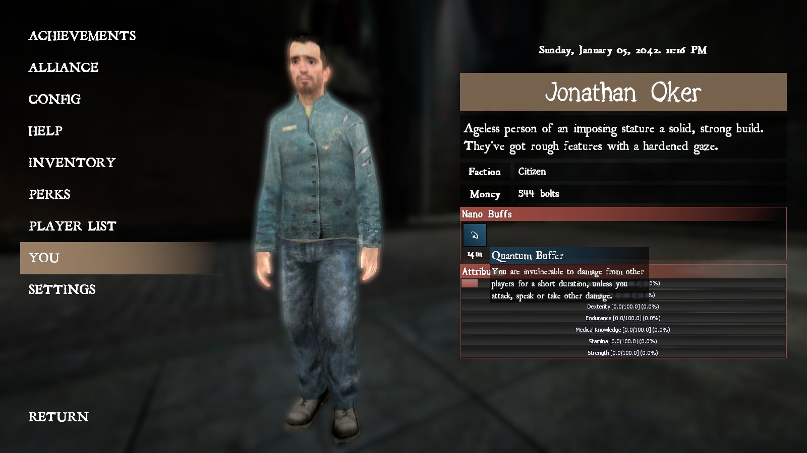
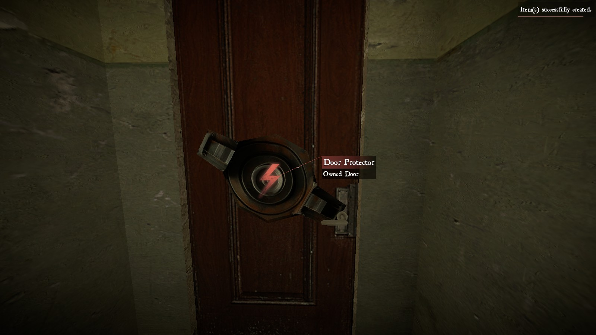
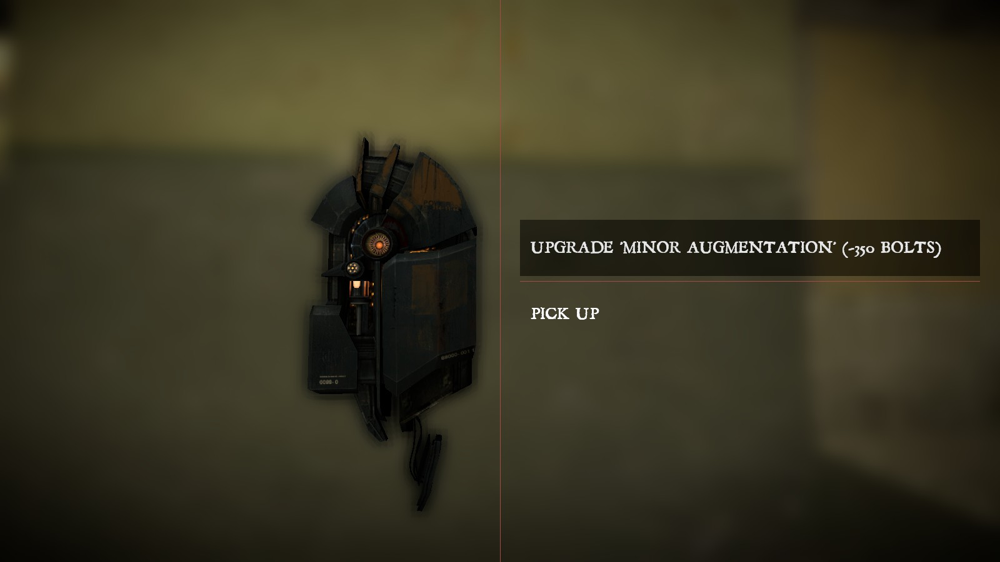
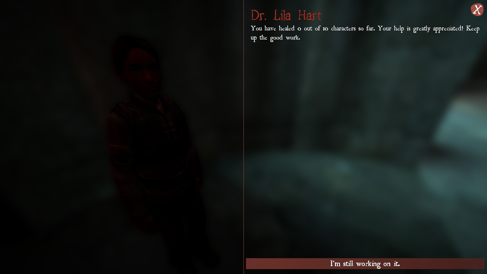

# Experiment Redux

**An FPS RPG gamemode for Garry's Mod, built using the [Helix framework](https://github.com/nebulouscloud/helix).**

<div align="middle">


**🐕 It's a dog-eat-dog world out there, and these dogs have guns.**

</div>

## Installation

1. Subscribe to the required addons on the [Steam Workshop Collection](https://steamcommunity.com/sharedfiles/filedetails/?id=3215035081).

2. Install Git LFS by following the [official installation instructions](https://git-lfs.github.com/).

3. Clone this repository into your `garrysmod/gamemodes` directory and name the directory `experiment-redux`:

    ```sh
    git clone https://github.com/luttje/gmod-experiment-redux experiment-redux
    ```

4. Ensure you have the Helix based installed [following the Helix documentation](https://docs.gethelix.co/manual/getting-started/).

5. (Re-)start Garry's Mod and start a game with the `Experiment Redux` gamemode.

## About

**Experiment Redux** is a reimagining of the original *Experiment* gamemode for Garry's Mod. It combines elements of first-person shooters, role-playing games, and survival games, along with a month-long competitive cycle to create a unique gameplay experience.

&raquo; **Read more in our [🔮 Vision](docs/vision.md) document**

## 📸 Screenshots

<details>

<summary>Create a single character to play for the Epoch</summary>


</details>

<details>

<summary>Select a spawn point to start/respawn from</summary>


</details>

<details>

<summary>Manage your inventory and equipment</summary>


</details>

<details>

<summary>View your character's stats and nano buffs</summary>



</details>

<details>

<summary>Store items in your locker for safekeeping</summary>


</details>

<details>

<summary>Buy and sell items at The Business</summary>


</details>

<details>

<summary>Protect your door with a door protector</summary>




</details>

<details>

<summary>Upgrade your bolt generator to produce more bolts</summary>




</details>

<details>

<summary>Scavenge for items in this forsaken city</summary>


</details>

<details>

<summary>The medic NPC will ask for your aid</summary>




</details>

<details>

<summary>Monsters roam a select location in the city, slay them for loot</summary>


</details>

<details>

<summary>Compete in a footrace against other players to improve your attributes</summary>


</details>

<details>

<summary>Improve your attributes at the target practice NPC</summary>


</details>

## Hosting a Server

For a quick overview check out the [🏗 Dev Server Guide](docs/dev-server-guide.md). This guide will walk you through setting up a dedicated server for development purposes.

You can find more information on hosting a Garry's Mod server in the [official documentation](https://wiki.facepunch.com/gmod/Downloading_a_Dedicated_Server).

## Content

**This project will maintain a minimal schema to run Experiment on Helix. It will only contain code and content that can be licensed under the MIT license.** This means we can not include content from the original Experiment schema that used third-party assets for items like the Exo Skeletons inside the repository.

Other third-party content may be included through the use of the [Steam Workshop](https://steamcommunity.com/app/4000). See [the `customizable_weaponry` plugin](plugins/customizable_weaponry) for an example of how to include third-party content.

## License

This project is licensed under the MIT license. See the [LICENSE](./LICENSE) file for details.

The original Experiment was developed by Conna Wiles around 2009. You'll find a lot of his code in this project, which you can originally find MIT licensed code in his [`kurozael/project-archive` repository](https://github.com/kurozael/project-archive)
