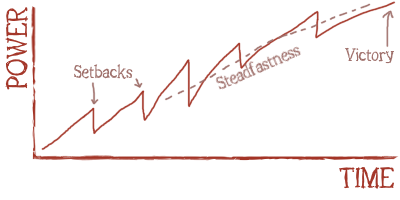

# 🔮 Vision

> [!NOTE]
> This document outlines the vision we currently have for *Experiment Redux*. It is a living document and subject to change as the project evolves.
> If you have any feedback or suggestions, please feel free to share them with us by [creating an issue or commenting on an existing one](https://github.com/luttje/gmod-experiment-redux/issues).

In *Experiment Redux*, players enter a dystopian city marked by brutal competition and fragile alliances. Set in a grim, post-apocalyptic Eastern European city, they will grind for bolts to obtain top-tier weapons and armor, fend off vicious mutants, and navigate treacherous streets dominated by a ruthless AI nemesis. Their journey will demand survival, strategy, and perseverance.

## Key Pillars

### Story and Nemesis AI

The narrative unfolds through the city's grim setting, where players must navigate dangers and challenges to uncover the secrets of this post-apocalyptic world. The nemesis AI serves as a central antagonist, driving conflict and tension throughout the city.

Players are cursed to repeatedly awaken in the city, coaxed by the AI into a never-ending cycle of struggle and betrayal against other competitors.

A small group of rebels hides in the city's shadows, attempting to awaken players to the AI's control and break the cycle of violence. With enough wealth and power, players can challenge the AI's rule, bringing hope to the city's cursed inhabitants.

The AI adjusts the difficulty of each Epoch, balancing it to give lower-ranked players a chance to rise through the ranks while challenging top players.

### Bolts and Power

Players grind for bolts, the in-game currency, to purchase weapons, armor, and other gear. Using these resources wisely provides a competitive edge in freeing the city from the AI's grip.

Bolts are generated using the Bolt Generator, which passively creates bolts over time. This device requires scrap to function, which is scattered throughout the city. Players must protect their Bolt Generators from other players and mutants, as the AI nemesis incentivizes competitors to steal bolts or destroy generators.

Success comes from strategic management, not brute force. Players must carefully manage their resources, forge alliances, and outwit opponents to rise to the top.

### Missions and Attributes

The story unfolds through missions that players undertake to uncover the city's secrets and gain power. NPCs encourage players to resist the AI and work together to defeat it.

Certain NPCs also offer missions that boost players' attributes, like strength and agility. These can give players an advantage in combat and survival, making them more formidable opponents.

### Survival and Cooperation

While PvP is a core element, the game emphasizes survival and cooperation. Players must band together to face the city's threats, including mutants and the AI nemesis. Although the AI attempts to sow discord, players are encouraged to unite against their common enemy.

The game rewards positive interactions and sportsmanship, reducing toxicity while promoting a cooperative community.

### Leaderboards and Epochs

The rebellion against the AI is cyclical, with each month-long 'Epoch' representing a new chapter in the city's history. Progress is tracked through leaderboards named 'Heroes of the Epoch.'

Players' progress is measured through various metrics, including bolts accumulated and spent, missions completed, and healing done. At the end of each Epoch, leaderboards are memorialized, and the game resets. Top players earn unique cosmetic items and recognition, ensuring all players start on an equal footing for the new Epoch.

A weighted system combines individual metrics into overall leaderboards, reflecting each player's overall performance.

### Setbacks and Rewards

Players face setbacks upon death, losing items and progress. This frustration aims to make the final reward more satisfying, as overcoming adversity to top the leaderboards is an achievement worth celebrating.

## Story Overview

This story overview sets the tone for the game's narrative and provides the foundation for the player's journey through the city. It remains purposefully vague to allow for flexibility and mystery in storytelling.

> A ruthless, unnamed AI controls the city, imposing a brutal regime on its inhabitants. Players are cursed to awaken repeatedly, coaxed by the AI to compete in a cycle of struggle and betrayal.
>
> The AI resides in a massive, ominous tower at the city's center. In the tower's basement are its failed experiments: mutants twisted and corrupted by its actions.
>
> A small group of rebels hides in the city's shadows, seeking to awaken players to the AI's control and help them break free from this cycle of violence.
>
> Players' journey is one of survival, strategy, and perseverance as they navigate treacherous streets, forge alliances, and outwit opponents to rise to the top and challenge the AI.

## Gamemode as a Game

Despite being a Garry's Mod gamemode, *Experiment Redux* aims to provide a full-fledged game experience within the constraints of the platform. Among other qualities, this means:

- **Consistent Experience:** Players should feel like they are playing a standalone game, not a hodgepodge of Garry's Mod addons.
- **Engaging Gameplay:** The game should be fun, challenging, and rewarding, with a clear sense of progression.
- **Polished Presentation:** The game should look and feel professional, with high-quality assets and a cohesive aesthetic.
- **Narrative Depth:** The story should be engaging and immersive, drawing players into the world and its characters.
